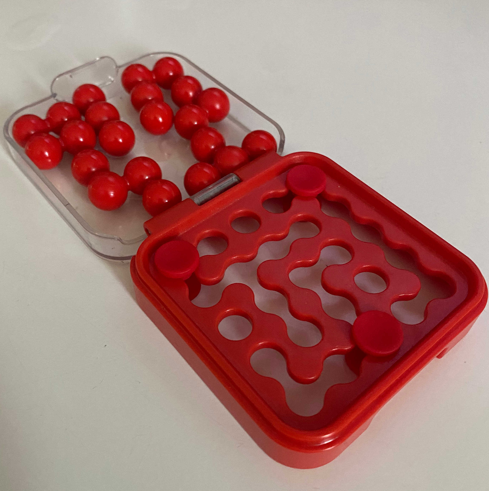

# About
this is a a project based on a puzzle game i was given. the point is to test if the game has any configuration which is unsolvable.



Currently, it can solve a set of stops (ie the 3 pieces you move around to make a puzzle) and also roll through and try all stops (here are the [solutions](doc/solutions.json)). This was generated by running: `go run main.go solve  --all  -o=json > doc/solutions.json`


# Build

```bash
go install golang.org/x/tools/cmd/stringer@latest
go install google.golang.org/protobuf/cmd/protoc-gen-go@v1.28
go install google.golang.org/grpc/cmd/protoc-gen-go-grpc@v1.2
go install github.com/grpc-ecosystem/grpc-gateway/v2/protoc-gen-grpc-gateway@latest
go get     github.com/grpc-ecosystem/grpc-gateway/v2/protoc-gen-openapiv2
go install github.com/grpc-ecosystem/grpc-gateway/v2/protoc-gen-openapiv2

go generate ./...
go build

```


# Usage

```bash
$ go run main.go solve --help
solve for default pieces

Usage:
  pg-puzzle solve [flags]

Flags:
  -a, --all            try every stop combination, not allowed with --stops
  -h, --help           help for solve
  -s, --stops string   board stops to solve, '[0-4],[0-4] [0-4],[0-4] [0-4],[0-4]' (default "0,0 0,4 4,2")
  -v, --verbose        with --all, print the solutions
  -n, --workers int    number of workers for --all (default 8)
```


# GRPC and Rest gateway

This now also has a `server` subcommand that will stand up a grpc server and also a rest gateway to proxy to it. To try out the rest gateway, do the following:

```bash

go run main.go server --rest=8080 &
curl -X 'POST'   'http://localhost:8080/v1/puzzle/solve'   \
  -H 'accept: application/json'   \
  -H 'Content-Type: application/json'  \
  -d '{"stopSet":[{"row":0,"col":0},{"row":0,"col":4},{"row":4,"col":2}]}'

# or just go direct to the gRPC endpoint using grpcurl (and jq to tidy the results)

grpcurl -plaintext [::]:10001 proto.Puzzle.Solve | jq . -c
# which returns
# {"solved":true,"solution":[2,4,7,7,8,0,4,7,7,8,5,4,4,6,8,5,5,9,6,6,0,9,9,9,6]}

# or try it passing a stop set

grpcurl -plaintext -d '{"stopSet":[{"row":0,"col":1},{"row":0,"col":4},{"row":4,"col":2}]}' \
        [::]:10001 proto.Puzzle.Solve | jq -c .
# which returns
# {"solved":true,"solution":[4,2,6,6,2,4,5,5,6,6,4,4,5,9,8,7,7,9,9,8,7,7,2,9,8]}


```

If you're running the gateway, the app also serves an swagger schema. The [openapiv2 schema file](./proto/puzzle.swagger.json) is generated via `go generate ./...` and accessible via http for the port used above at [openapiv2.json](http://localhost:8080/openapiv2.json). We also serve the [swagger-ui](http://localhost:8080/swagger-ui/) locally on this port as well.


# Notes on Images

You can use [ko](ko.build) to generate images based on this simple app out of the box. 
There is an example to build locally using 
[distroless](https://github.com/GoogleContainerTools/distroless) below.

```bash

KO_DEFAULTBASEIMAGE=gcr.io/distroless/static:nonroot 
ko build --base-import-paths --local
docker run  --rm -p 8080:8080   ko.local/pgpuzzle:latest   server --rest 8080

# in a different terminal
curl -X POST   http://localhost:8080/v1/puzzle/solve

```

If you want to push to a remote repository, set `KO_DOCKER_REPO` and don't use 
the `--local` flag. For example, with GCP's artifact registry, it would be as follows:
 
```bash
KO_DOCKER_REPO=${LOCATION}-docker.pkg.dev/${PROJECT}/pg-puzzle 
ko build --base-import-paths
```

`ko` has [kind](https://kind.sigs.k8s.io/) support and will push images to make 
them available to local kind clusters. Additionally, it can scan config and 
generate and update `image` tags within the config to point to the newly built 
image as well as deploy.  There is a sample [k8s config](doc/k8s/) to try this 
with a local kind cluster. 

```bash
CLUSTER=pgpuzzle
kind create cluster --name=${CLUSTER}
KO_DOCKER_REPO=kind.local KIND_CLUSTER_NAME=${CLUSTER}  ko apply -f doc/k8s/ --base-import-paths

## same thing for gcp would be as above
KO_DOCKER_REPO=${LOCATION}-docker.pkg.dev/${PROJECT}/${APP}  ko apply  --base-import-paths -f doc/k8s/


# to verify, run a k8s proxy and hit it locally
kubectl proxy 

# and in a different terminal
curl -X POST http://127.0.0.1:8001/api/v1/namespaces/default/services/pg-puzzle:8080/proxy/v1/puzzle/solve

# clean up
kind delete cluster --name=${CLUSTER}
```

Lastly, if you run this as a CloudRun job, be sure to select the networking option 
to 'Use HTTP/2 end-to-end' if you want to serve the gRPC port.  You can then reach 
it with grpcurl as follows:

```bash
grpcurl    ${ENDPOINT_WO_HTTP_PREFIX}:443    proto.Puzzle.Solve 
```


# Disclaimer 

I used this as an excuse to learn features of golang, lots can be improved in the code and the code style.


# TODOs

* TODO change the name of some of the `solve.go` files all over
* TODO have log levels for server stuff
* TODO enable GET for the rest server instead of POST
* TODO change the package name for the proto from `proto`